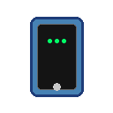

# 🤖 DroidBridge

<div align="center">



**Seamlessly connect, control, and mirror Android devices inside VS Code**

[](https://code.visualstudio.com/)
[](https://opensource.org/licenses/MIT)
[](https://github.com/Lusan-sapkota/DroidBridge)
[](https://www.lusansapkota.com.np)

[📥 Install](https://marketplace.visualstudio.com/items?itemName=LusanSapkota.droidbridge) • [📖 Documentation](https://lusan-sapkota.github.io/DroidBridge/) • [🐛 Issues](https://github.com/Lusan-sapkota/DroidBridge/issues) • [💼 Portfolio](https://www.lusansapkota.com.np)

</div>

---

## ✨ Features

DroidBridge transforms your VS Code into a powerful Android development hub with these key features:

### 🔌 **Wireless Device Management**
- **One-Click Connection**: Connect to Android devices over WiFi using IP address and port
- **Connection History**: Remember and quickly reconnect to recent devices
- **Smart Pairing**: Simplified pairing process for wireless debugging
- **Real-time Status**: Live connection status with detailed feedback

### 📱 **Integrated Screen Mirroring**
- **Sidebar Embedding**: Screen mirroring appears directly in the VS Code sidebar
- **Eject & Embed**: Switch between sidebar and external window modes
- **Optimized Performance**: Smart resolution and bitrate adjustments for smooth mirroring
- **Always-on-Top Mode**: Keep device screen visible while coding

### 🛠️ **Smart Binary Management**
- **Auto-Detection**: Finds existing ADB/scrcpy installations automatically
- **Zero-Config Setup**: Downloads required binaries when not found
- **Cross-Platform**: Works seamlessly on Windows, macOS, and Linux
- **Custom Paths**: Support for custom binary locations

### 🎨 **Native VS Code Integration**
- **Theme Adaptive**: Automatically matches VS Code's light/dark themes
- **Command Palette**: Access all features via `Ctrl+Shift+P`
- **Status Bar**: Quick status indicators and controls
- **Comprehensive Logging**: Detailed logs for troubleshooting

## 🚀 Quick Start

### Installation

#### **VS Code Marketplace** (Recommended)
```bash
# Search for "DroidBridge" in Extensions (Ctrl+Shift+X)
# Or install via command line
code --install-extension LusanSapkota.droidbridge
```

#### **Manual Installation**
1. Download the latest `.vsix` from [Releases](https://github.com/Lusan-sapkota/DroidBridge/releases)
2. Install via: `Extensions → ... → Install from VSIX...`

### Setup Your Android Device

1. **Enable Developer Options**:
   ```
   Settings → About Phone → Tap "Build Number" 7 times
   ```

2. **Enable Wireless Debugging**:
   ```
   Settings → Developer Options → Enable "Wireless Debugging"
   ```

3. **Get Connection Details**:
   ```
   Developer Options → Wireless Debugging → Note IP:Port (e.g., 192.168.1.100:5555)
   ```

### Connect & Mirror

1. **Open DroidBridge**: Click the 🤖 icon in VS Code's Activity Bar
2. **Connect Device**: Enter IP address and port, click "Connect Device"
3. **Start Mirroring**: Click "Launch Scrcpy" - screen appears in sidebar!
4. **Eject/Embed**: Use controls to switch between sidebar and external window modes

> 💡 **Pro Tip**: DroidBridge automatically handles ADB and scrcpy binaries - no manual installation needed!

## 🖥️ Interface Overview

### Sidebar Sections

#### **📱 Screen Mirror**
- **Live Preview**: Device screen embedded directly in sidebar
- **Eject Button**: Move to external window for larger view
- **Close Button**: Stop mirroring session
- **Status Indicator**: Real-time connection status

#### **🔌 Device Connection**
- **IP/Port Fields**: Pre-filled with your last successful connection
- **Connect/Disconnect**: One-click connection management
- **Status Display**: Connection state with helpful error messages

#### **🔄 Scrcpy Controls**
- **Launch Scrcpy**: Start screen mirroring (sidebar mode by default)
- **Launch Screen Off**: Mirror with device screen off (battery saving)
- **Stop Scrcpy**: Terminate current mirroring session

#### **🕐 Connection History**
- **Recent Devices**: Quick access to your last 5 connections
- **One-Click Reconnect**: Click the plug icon to instantly reconnect
- **Manage History**: Remove unwanted entries with trash icon

#### **⚙️ Wireless Pairing**
- **Manual Pairing**: Enter host, port, and 6-digit code from device
- **Quick Setup**: Streamlined pairing for first-time connections

### Command Palette

Access all features via `Ctrl+Shift+P` / `Cmd+Shift+P`:

```
DroidBridge: Connect to Device
DroidBridge: Disconnect Device
DroidBridge: Launch Scrcpy
DroidBridge: Launch Scrcpy Screen Off
DroidBridge: Stop Scrcpy
DroidBridge: Eject Scrcpy from Sidebar
DroidBridge: Embed Scrcpy in Sidebar
DroidBridge: Show Logs
DroidBridge: Check Binary Status
DroidBridge: Download Missing Binaries
DroidBridge: Refresh Binary Detection
```

## ⚙️ Configuration

### VS Code Settings

Configure DroidBridge via `Settings` → `Extensions` → `DroidBridge`:

| Setting | Description | Default |
|---------|-------------|---------|
| `droidbridge.defaultIp` | Default IP address for connections | `"192.168.1.100"` |
| `droidbridge.defaultPort` | Default port for ADB connection | `"5555"` |
| `droidbridge.adbPath` | Custom ADB binary path (optional) | `""` |
| `droidbridge.scrcpyPath` | Custom scrcpy binary path (optional) | `""` |

### Configuration Examples

<details>
<summary><strong>📱 Basic Setup</strong></summary>

```json
{
  "droidbridge.defaultIp": "192.168.1.150",
  "droidbridge.defaultPort": "5555"
}
```
</details>

<details>
<summary><strong>🛠️ Custom Binary Paths</strong></summary>

```json
{
  "droidbridge.adbPath": "/usr/local/bin/adb",
  "droidbridge.scrcpyPath": "/usr/local/bin/scrcpy"
}
```
</details>

<details>
<summary><strong>🏢 Development Environment</strong></summary>

```json
{
  "droidbridge.defaultIp": "10.0.0.100",
  "droidbridge.defaultPort": "5037",
  "droidbridge.adbPath": "/Android/Sdk/platform-tools/adb",
  "droidbridge.scrcpyPath": "/usr/local/bin/scrcpy"
}
```
</details>

## 🔧 Binary Management

DroidBridge features an intelligent binary management system that handles ADB and scrcpy automatically:

### 🔍 Smart Detection Process

1. **Custom Paths** → Your configured binary locations
2. **System PATH** → Homebrew, apt, chocolatey installations  
3. **Common Directories** → Platform-specific standard locations
4. **Auto-Download** → Fetches latest binaries from [droidbridge-binaries](https://github.com/Lusan-sapkota/droidbridge-binaries)

### 🛠️ Management Commands

| Command | Description |
|---------|-------------|
| `Check Binary Status` | View current detection status for all binaries |
| `Download Missing Binaries` | Download any missing ADB/scrcpy binaries |
| `Refresh Binary Detection` | Re-scan system for existing installations |

### 📦 Supported Platforms

| Platform | ADB Source | Scrcpy Source |
|----------|-----------|---------------|
| **Windows** | Android SDK, Chocolatey, Manual | GitHub Releases, Chocolatey |
| **macOS** | Android SDK, Homebrew, Xcode | Homebrew, GitHub Releases |
| **Linux** | Android SDK, apt/yum/pacman | Package Manager, AppImage |

### 🌐 Offline Usage

No internet? No problem:
1. Install binaries manually via package manager
2. Add them to your system PATH
3. Or configure custom paths in settings

> 💡 **Binary hosting**: All binaries are securely hosted at [github.com/Lusan-sapkota/droidbridge-binaries](https://github.com/Lusan-sapkota/droidbridge-binaries)

## 🔧 Troubleshooting

<details>
<summary><strong>🔌 Connection Issues</strong></summary>

### Device Won't Connect
- ✅ Both device and computer on same WiFi network
- ✅ Wireless debugging enabled in Developer Options
- ✅ Correct IP address and port entered
- ✅ Try: `adb kill-server && adb start-server`

### "Device Offline" Error
- 🔄 Disconnect and reconnect device
- 🌐 Check network connectivity
- 📱 Restart wireless debugging on device
- 🛡️ Check firewall/VPN settings

</details>

<details>
<summary><strong>📱 Screen Mirroring Issues</strong></summary>

### Scrcpy Won't Launch
- ✅ Device connected via ADB first
- ✅ USB debugging enabled
- ✅ Device authorization prompt accepted
- 🧪 Test manually: `scrcpy --help`

### Poor Performance
- 📐 Lower resolution (max-size parameter)
- 📊 Reduce bitrate
- 🚫 Close other device apps
- 🌐 Check WiFi bandwidth

### Sidebar Embedding Problems
- 🔄 Try eject → embed cycle
- ⏹️ Stop and restart scrcpy
- 🪟 Check if external window is hidden

</details>

<details>
<summary><strong>💾 Binary Issues</strong></summary>

### "Binary Not Found" Errors
1. Run `Check Binary Status` command
2. Use `Download Missing Binaries`
3. Manual installation:
   ```bash
   # Windows (Chocolatey)
   choco install adb scrcpy

   # macOS (Homebrew)  
   brew install android-platform-tools scrcpy

   # Linux (Ubuntu/Debian)
   sudo apt install adb scrcpy
   ```

### Download Failures
- 🌐 Check internet connection
- 🛡️ Verify firewall/proxy settings
- 🔄 Try `Refresh Binary Detection`
- ⚙️ Configure custom paths

</details>

<details>
<summary><strong>🆘 Getting Help</strong></summary>

1. **📋 Check Logs**: `DroidBridge: Show Logs`
2. **🔄 Reset Settings**: Clear custom paths
3. **♻️ Restart Extension**: `Developer: Reload Window`
4. **🐛 Report Issues**: [GitHub Issues](https://github.com/Lusan-sapkota/DroidBridge/issues)

</details>

## 📋 Requirements

### 💻 System Requirements
| Component | Requirement |
|-----------|-------------|
| **VS Code** | 1.104.0+ |
| **OS** | Windows 10+ / macOS 10.14+ / Linux (Ubuntu 18.04+) |
| **Android** | 5.0+ with Developer Options |
| **Network** | Same WiFi network for device & computer |

### 🔧 Dependencies

DroidBridge automatically manages these essential tools:

<table>
<tr>
<td>

**🔌 ADB (Android Debug Bridge)**
- Device connection & communication
- Auto-downloaded if missing
- Custom paths configurable

</td>
<td>

**📱 Scrcpy**
- High-performance screen mirroring
- Lightweight & efficient
- Optimized settings included

</td>
</tr>
</table>

> 💡 **Smart Binary Management**: Extension automatically detects, downloads, and configures all required tools. No manual setup needed!

## ⚠️ Known Issues

| Issue | Description | Workaround |
|-------|-------------|------------|
| 🔄 **Multiple Instances** | Scrcpy instances may conflict | Stop existing sessions first |
| 📱 **Device Setup** | Some devices need extra wireless setup | Follow device-specific guides |
| 🌐 **WiFi Latency** | Network can affect performance | Use 5GHz WiFi or USB debugging |
| 🪟 **Windows Paths** | Custom binaries need `.exe` extension | Include full path with extension |

## 🤝 Contributing

We welcome contributions! Help make DroidBridge even better.

### 🚀 Quick Start
```bash
# 1. Fork the repository
git clone https://github.com/yourusername/DroidBridge.git

# 2. Install dependencies
npm install

# 3. Start development
npm run watch

# 4. Test your changes
npm test
```

### 📝 Contribution Guidelines
- 🌿 Create feature branches from `main`
- ✅ Add tests for new functionality  
- 📚 Update documentation
- 🧹 Follow existing code style
- 📋 Submit detailed pull requests

### 🐛 Bug Reports
Found a bug? [Create an issue](https://github.com/Lusan-sapkota/DroidBridge/issues) with:
- Steps to reproduce
- Expected vs actual behavior
- Environment details (OS, VS Code version, etc.)

---

## 👨‍💻 About

**Created by [Lusan Sapkota](https://lusansapkota.com.np)**

DroidBridge combines modern Android development tools with VS Code's powerful interface, making device management effortless and productive.

- 🌟 **Binaries Repository**: [DroidBridge-Binaries](https://github.com/Lusan-sapkota/DroidBridge-Binaries)
- 💼 **Portfolio**: [lusansapkota.com.np](https://lusansapkota.com.np)
- 📧 **Contact**: Available through GitHub or portfolio site

### 💝 Support This Project

If DroidBridge has improved your development workflow:
- ⭐ Star this repository
- 🐛 Report bugs and suggest features
- 🤝 Contribute code or documentation
- 🗣️ Share with other developers

---

<div align="center">

**Made with ❤️ for the Android development community**

[](https://code.visualstudio.com/)
[](https://developer.android.com/)

</div>

## License

This project is licensed under the MIT License - see the LICENSE file for details.

## Acknowledgments

- [scrcpy](https://github.com/Genymobile/scrcpy) - Screen mirroring tool
- [Android Debug Bridge (ADB)](https://developer.android.com/studio/command-line/adb) - Android debugging tool
